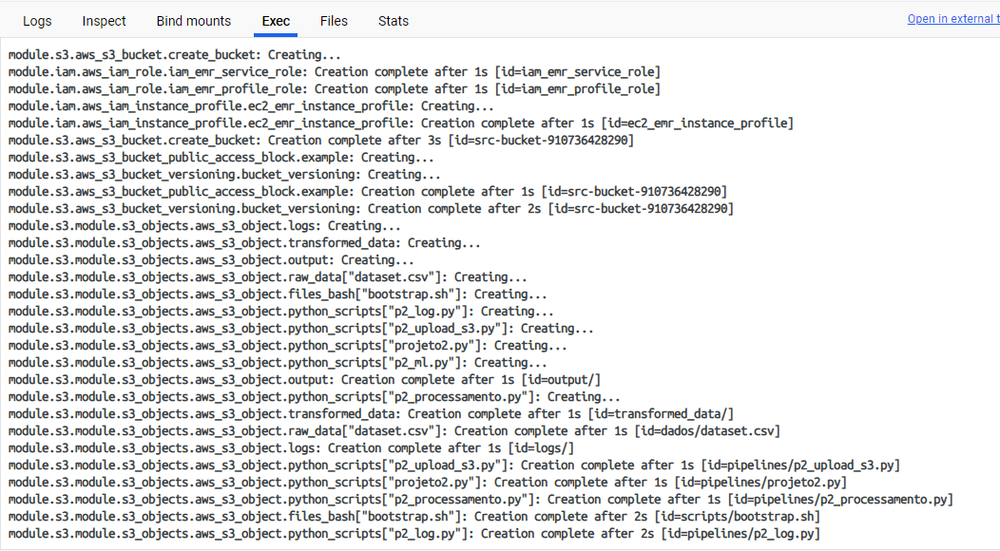
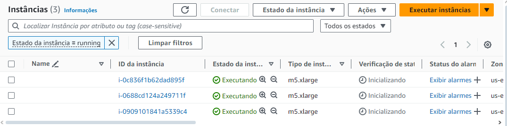
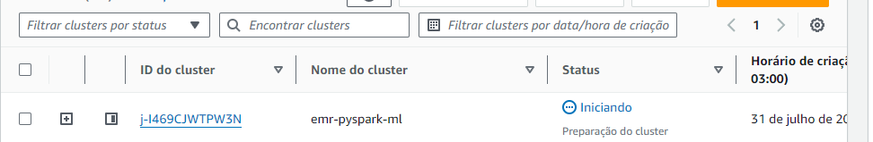

# Deploy de uma Stack de Treinamento Distribuido de Machine Learning com PySpark e Amazon EMR e o impacto da Automação de Infraestrutura no Desenvolvimento de Modelos de Machine Learning. 🚀

OBS: Esse projeto é uma extensão/variante do projeto anterior: https://github.com/Brunotorres15/emr-flink-aws
No projeto anterior, foi automatizada toda uma infraestrutura de processamento distribuído, que uma vez provisionada, nos permite submeter scripts pra processamento no cluster EMR; Neste novo projeto, os scripts são disponibilizados junto com a infraestrutura e todo o processamento, treinamento do modelo e obtenção dos resultados já são feitos de forma automatizada.

___

### 📌 IA na era da informação e a ideia do projeto
Os modelos de Machine Learning estão se tornando essenciais em diversos setores do mercado, transformando a maneira como as empresas tomam decisões, otimizam operações e interagem com os clientes. De previsões de demanda e detecção de fraudes a recomendações personalizadas e manutenção preditiva, a aplicação desses modelos está em plena expansão. No entanto, desenvolver e treinar esses modelos em escala requer uma infraestrutura robusta e eficiente, algo que muitas vezes pode ser um desafio significativo.

### 📌 Como facilitar o desenvolvimento desses modelos?
A automação de uma infraestrutura para treinamento distribuído de Machine Learning, como a exemplo desta solulação utilizando o PySpark e Amazon EMR, oferece uma solução poderosa para enfrentar esses desafios. Através de uma abordagem automatizada, é possível provisionar, configurar e gerenciar clusters de processamento de dados de forma eficiente e escalável, atacando pontos importantes como a aceleração do Desenvolvimento de Modelos, Escalabilidade Dinâmica, Consistência e Reprodutibilidade.

### 📌 Portanto, qual o impacto de uma solução como essa?
No contexto atual, onde os modelos de Machine Learning são cada vez mais cruciais para o sucesso das empresas, ter uma solução automatizada para gerenciar a infraestrutura de treinamento desses modelos se torna um diferencial competitivo. A automação com PySpark e Amazon EMR não só simplifica a complexidade operacional, mas também potencializa o desenvolvimento de soluções de Machine Learning mais rápidas, eficientes e econômicas.

Implementar essa abordagem permite que as organizações mantenham a agilidade necessária para responder às demandas do mercado, ao mesmo tempo em que promovem uma cultura de inovação contínua. Em última análise, isso se traduz em uma capacidade aprimorada de transformar dados em ações estratégicas, impulsionando o crescimento e a competitividade.
___

## Porque eu escolhi utilizar essas ferramentas? (Pyspark, Amazon EMR e o Terraform?)
**PySpark**: Facilita o processamento distribuído de grandes volumes de dados com uma interface simples em Python, integrando-se bem com o ecossistema Hadoop e oferecendo ferramentas robustas de Machine Learning.

**Amazon EMR**: Proporciona uma plataforma gerenciada e escalável para executar frameworks de big data como Spark, reduzindo o esforço de configuração e gerenciamento, e permitindo a escalabilidade automática e integração com outros serviços AWS.

**Terraform**: Automatiza a provisão e gerenciamento da infraestrutura, garantindo consistência e reprodutibilidade, além de permitir a implementação de infraestrutura como código (IaC), o que facilita a manutenção e atualização de recursos na nuvem. 

## Estrutura do Projeto

```
📦 IaC
├─ dados
├─ modules
├─ pipelines
├─ scripts
├─ config.tf
├─ main.tf
├─ terraform.tfvars
└─ variables.tf
Dockerfile
```

O projeto está organizado em diferentes módulos do Terraform e scripts Python que são executados no cluster EMR. A estrutura principal inclui os seguintes arquivos e pastas:

```main.tf: Arquivo principal do Terraform que chama os módulos necessários.```

```modules/: Pasta contendo os módulos de Terraform para criação e configuração dos recursos (EMR, network, iam, S3).```

```pipelines/: Pasta contendo os scripts Python que serão executados no cluster EMR.```

```Scripts/: Pasta contendo o script em bash para instalação das bibliotecas necessárias no cluster.```

```dados/: Pasta contentendo a fonte de dados que será utilizada pra treinar o modelo.```

```config.tf/: Este arquivo contém a configuração inicial e o backend para o Terraform. Ele define onde o estado do Terraform será armazenado, permitindo a colaboração entre equipes e persistência do estado.```

```terraform.tfvars/: Este arquivo contém os valores das variáveis definidas no variables.tf. Ele é usado para fornecer valores específicos de configuração, como nomes de bucket, regiões, IDs de sub-redes, etc.```

```variable.tf/: Este arquivo define todas as variáveis utilizadas no main.tf e outros arquivos de configuração. Cada variável pode ter um tipo, uma descrição e um valor padrão.```

___

## Como replicar o projeto?

#### Clone o Repositório
```
git clone https://github.com/Brunotorres15/emr-pyspark-ml.git
```

### Execute o comando abaixo para criar a imagem Docker

```
docker build -t emr-pyspark-ml-image:v1 .
```

### Execute o comando abaixo para criar o container Docker

```
docker run -dit --name emr-pyspark-ml-container -v ./IaC:/iac emr-pyspark-ml-image:v1 /bin/bash
```
NOTA: No Windows você deve substituir ./IaC pelo caminho completo da pasta

___
- *Criação do Bucket para armazenar o estado do terraform remotamente:*

 É necessário criar um Bucket S3 pra armazenazar o estado remoto do terraform, dessa forma, mesmo que localmente você perca seus arquivos, tendo o estado armazenado de forma remota, tanto você, como seus colegas de equipe poderão destruir de forma automatizada tudo que foi provisionado com script do terraform que gerou aqueleq arquivo de estado.

 Uma vez que o bucket foi criado, basta colocar o nome dele em:
    ```
    bucket = nome-do-bucket
    ``` 
    no arquivo **config.tf**, dessa forma o terraform irá guardar o arquivo de estado no bucket informado.

- *Definir o nome dos buckets de armazenamento e de logs:*

No arquivo **terraform.tfvars**, nas opções: 
```
name_bucket  = nome-do-bucket
```

```
log_uri_bucket = nome-do-bucket
```

você deve definir o nome desses buckets que serão provisionados pelo terraform.


## Provisionando a Infraestrutura de processamento 


### Configure as suas credenciais de acesso à AWS via cli
```
aws configure
```

### Inicialize o Terraform
```
terraform init
```
### 🚀 Provisionando toda a infraestrutura com dois comandos!

#### Cria o Plano de Execução do terraform e salva em disco

```
terraform plan -var-file terraform.tfvars -out terraform.tfplan
```
Obs: 
- *-var-file é pra indicar qual arquivo de configuração estamos utilizando pra buscar aos valores das variáveis que setamos.* 
- -out é o arquivo de saída que vai guardar nosso plano de execução.

### Executa o apply do plano de execução, informando nomavente o arquivo onde estão as variáveis (com auto-approve)

```
terraform apply -auto-approve -var-file config.tfvars
```

### Opcional: Executa o apply com o arquivo de variáveis (sem auto-approve)
```
terraform apply -var-file config.tfvars
```

# Infraestrutura Provisionada!

Log do terraform provisionando os recursos.


***Visualizando o provisionamento da infraestrutura pelo docker-desktop***


Uma vez que o provisionamento aconteceu, você pode verificar que os clusters, buckets e execução dos scripts já ocorreram de forma automatizada, tudo conforme configuramos.



***Master e Workers provisionados***


***Buckets criados e upload dos arquivos realizados***


***Cluster EMR sendo provisionado***


***Steps sendo executado de forma automatizada***


# ✅ Conclusão

*Com o uso do Terraform, automatizamos a criação e configuração de clusters EMR, garantindo que todo o processo, desde a provisão da infraestrutura até o treinamento do modelo e obtenção dos resultados, fosse realizado de forma automatizada e eficiente.*

**📌 Resultados Alcançados**

**Automação Completa**: Implementamos uma infraestrutura que permite a execução automatizada de scripts de treinamento de modelos de Machine Learning, eliminando a necessidade de intervenções manuais.

**Escalabilidade e Eficiência**: Utilizando Amazon EMR, conseguimos escalar a infraestrutura conforme necessário, otimizando o uso de recursos e reduzindo custos.

**Consistência e Reprodutibilidade**: Com Terraform, garantimos que a infraestrutura seja provisionada de forma consistente e reprodutível, facilitando a manutenção e atualização dos recursos.*

**Impacto**:
Ao simplificar a complexidade operacional e potencializar o desenvolvimento de soluções de Machine Learning, essa abordagem automatizada não só melhora a eficiência e a economia, mas também proporciona uma vantagem competitiva significativa. Em última análise, essa solução permite que as organizações transformem dados em ações estratégicas, impulsionando o crescimento e a competitividade no mercado.

Com essa infraestrutura, estamos bem posicionados para enfrentar os desafios futuros e continuar desenvolvendo soluções de Machine Learning inovadoras e impactantes.